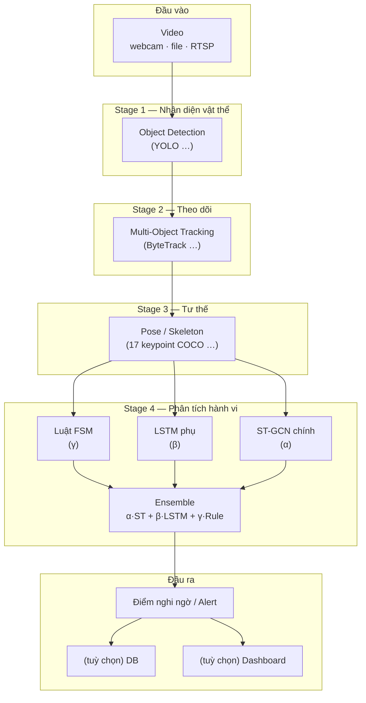

# Kiến trúc tổng quan — Nhận diện hành vi bất thường trong siêu thị (KLTN)

**Đề tài:** *Ứng dụng học sâu trong nhận diện hành vi bất thường trong siêu thị.*

Tài liệu gồm hai phần: **(A) kiến trúc hệ thống** — nhìn nhanh pipeline; **(B) khớp đề cương** — nội dung song song báo cáo chính `report/KLTN-KTDL- Nhóm Hải + Hảo.docx`.

---

## Mục lục

| # | Nội dung |
|---|----------|
| 1 | [Kiến trúc tổng quan hệ thống](#1-kiến-trúc-tổng-quan-hệ-thống-nên-đọc-trước) |
| 2 | [Luồng dữ liệu theo từng bước](#2-luồng-dữ-liệu-theo-từng-bước) |
| 3 | [Stage 4: hành vi & ensemble](#3-stage-4-hành-vi--ensemble) |
| 4 | [Cấu trúc thư mục gợi ý](#4-cấu-trúc-thư-mục-gợi-ý) |
| 5 | [Config, stack, thứ tự code](#5-config-stack-thứ-tự-code) |
| 6 | [Khớp mẫu báo cáo / đề cương](#6-khớp-mẫu-báo-cáo--đề-cương) |
| 7 | [Lưu ý triển khai & `.gitignore`](#7-lưu-ý-triển-khai--gitignore) |

---

## 1. Kiến trúc tổng quan hệ thống (nên đọc trước)

### 1.1. Ý tưởng một câu

**Video** → phát hiện người/vật → **giữ ID** theo thời gian → **ước lượng khung xương** → **ba nhánh** (luật FSM + LSTM + ST-GCN) **cộng điểm** → **cảnh báo** (và tùy chọn: DB, dashboard, clip chứng cứ).

### 1.2. Sơ đồ pipeline (trên xuống)



### 1.3. Bảng tóm tắt 4 stage

| Stage | Tên | Việc làm | Đầu ra gợi ý | Công nghệ (gợi ý) |
|:-----:|-----|----------|--------------|-------------------|
| **1** | Detection | Tìm bbox người + vật (hàng, túi, …) | Danh sách `(bbox, class, score)` / frame | YOLOv8 / YOLOv11 |
| **2** | Tracking | Gắn cùng một người qua nhiều frame | `track_id` + bbox ổn định | ByteTrack, (DeepSORT so sánh) |
| **3** | Pose | Lấy khớp xương theo từng người được track | Chuỗi `(T, J, 3)` sau chuẩn hóa | YOLO-Pose, RTMPose, … |
| **4** | Behavior | Kết hợp skeleton + feature + luật | `final_score`, có/không alert | ST-GCN, LSTM, FSM → Ensemble |

**Ký hiệu:** `T` = số frame cửa sổ thời gian; `J` = số khớp (thường 17 COCO).

### 1.4. Nhìn nhanh không cần Mermaid

```
Video → [1 Detect] → [2 Track] → [3 Pose] → ┬→ FSM ────┐
                                            ├→ LSTM ──→ [Ensemble] → Alert (+ DB / UI)
                                            └→ ST-GCN ┘
```

---

## 2. Luồng dữ liệu theo từng bước

1. Đọc **frame** thời điểm `t`.
2. **Detect** → persons + objects (nếu thiết kế có class hàng/túi).
3. **Track** → mỗi person một **`track_id`** (buffer theo ID, không theo frame lẻ).
4. **Pose** → skeleton cho từng `track_id`.
5. **Buffer** → tích lũy đủ **T** frame mới chạy ST-GCN / LSTM; FSM có thể cập nhật **mỗi frame**.
6. **Ensemble** → `final_score`; nếu ≥ ngưỡng → **alert**.
7. Tuỳ chọn: ghi **DB**, cắt **clip chứng cứ**, **Streamlit**.

**Đo hiện năng:** log **ms/frame** (hoặc FPS) **từng stage** để báo cáo latency.

---

## 3. Stage 4: hành vi & ensemble

### 3.1. Ba nhánh

| Nhánh | Vai trò | Trọng số (ví dụ) | Ghi chú luận văn |
|-------|---------|------------------|------------------|
| **ST-GCN** | Học **không gian + thời gian** trên đồ thị khớp | **α** (thường cao nhất) | Đóng góp chính, ablation “chỉ ST-GCN” |
| **LSTM** | Chuỗi **feature thủ công** (khoảng cách tay–túi, vận tốc, …) | **β** | So sánh với ST-GCN |
| **FSM (rule)** | Trạng thái: duyệt → chạm hàng → che giấu … (IoU, thời gian) | **γ** | Giải thích được, baseline luật |

### 3.2. Công thức ensemble

```
final_score = α × score_ST-GCN + β × score_LSTM + γ × score_rule     (α + β + γ = 1)
```

- **Alert** khi `final_score ≥ threshold` (threshold tune trên tập validation).

### 3.3. Ablation (5 cấu hình — Chương thực nghiệm)

| Cấu hình | α | β | γ | Ý nghĩa |
|----------|---|---|---|---------|
| **A** | 0 | 0 | 1 | Chỉ luật |
| **B** | 0 | 1 | 0 | Chỉ LSTM |
| **C** | 1 | 0 | 0 | Chỉ ST-GCN |
| **D** | tune | tune | 0 | ST-GCN + LSTM |
| **E** | tune | tune | tune | Full ensemble |

---

## 4. Cấu trúc thư mục gợi ý

```text
project_root/
├── ARCHITECTURE.md
├── requirements.txt
├── configs/config.yaml
├── main.py
├── src/
│   ├── detection/      # Stage 1
│   ├── tracking/       # Stage 2
│   ├── pose/           # Stage 3
│   ├── behavior/       # Stage 4: stgcn, lstm, fsm, ensemble
│   ├── database/
│   └── dashboard/
├── data/
├── models/weights/    models/onnx/
├── logs/
├── outputs/
└── documents/         # mẫu .docx, sơ đồ, slide
```

**Import:** thêm `__init__.py` hoặc cấu hình `PYTHONPATH` / package editable — chọn một cách và giữ cố định.

---

## 5. Config, stack, thứ tự code

### 5.1. `configs/config.yaml` (hiện trống — gợi ý nội dung sau)

- Đường dẫn weight, `conf` / `iou`, kích thước ảnh; tham số tracker; cửa sổ **T**, FPS mục tiêu.
- **α, β, γ**, `alert_threshold`; URL DB (ưu tiên biến môi trường); đường dẫn evidence / log.

### 5.2. Stack tham khảo

Python 3.10+, PyTorch, OpenCV, Ultralytics (YOLO); ST-GCN có thể chỉ cần `torch` + ma trận kề; tuỳ chọn PyG, Streamlit, Plotly, PostgreSQL + SQLAlchemy, ONNX, pytest, logging.

### 5.3. Thứ tự tự code (đề xuất)

1. Đọc video + hiển thị frame  
2. Stage 1: detect person (pretrained)  
3. Stage 2: track ổn định `track_id`  
4. Stage 3: pose + buffer `(T,J,3)` + normalize  
5. Stage 4a: FSM đơn giản  
6. Stage 4b: LSTM  
7. Stage 4c: ST-GCN + train  
8. Ensemble + ablation + metrics  
9. DB + dashboard + ONNX (nếu kịp)

---

## 6. Khớp mẫu báo cáo / đề cương

File tham chiếu: **`report/KLTN-KTDL- Nhóm Hải + Hảo.docx`** (cấp gốc dự án).

### 6.1. Tính cấp thiết (tóm tắt)

- Shrinkage / trộm cắp; CCTV nhiều nhưng giám sát thủ công dễ quá tải, sót hành vi.
- Cần **action recognition theo chuỗi**, không chỉ detection tĩnh.
- Siêu thị: đông người, occlusion, góc camera đa dạng → cần thuật toán bền, hướng **thời gian thực**.

### 6.2. Mục đích & mục tiêu cụ thể

**Mục đích:** hệ thống học sâu **nhận diện & phân loại** hành vi bất thường, trọng tâm **cất giấu hàng trái phép**, từ video siêu thị.

**Mục tiêu:** (1) MOT ổn định người + vật; (2) CNN + LSTM + GCN cho đặc trưng không gian–thời gian; (3) dataset public + tự thu, gán nhãn (CVAT, LabelImg…); (4) demo thời gian thực + giao diện cảnh báo.

### 6.3. Cách tiếp cận → map kỹ thuật

| Mẫu báo cáo | Ý tưởng | Trong kiến trúc này |
|-------------|---------|---------------------|
| Skeleton + temporal | Khớp + quỹ đạo vật, ít phụ thuộc màu/ánh sáng | §1 Stage 3–4, buffer theo `track_id` |
| Lý thuyết CNN / LSTM / GCN | Thị giác + chuỗi + đồ thị cơ thể | Stage 1–3 CNN; Stage 4 LSTM + ST-GCN |
| Thực nghiệm | YOLO, ByteTrack, ST-GCN | §1 bảng stage |
| Đánh giá | mAP, P/R/F1, FPS, latency | Log từng stage; bảng ablation §3.3 |

**Ghi chú:** mẫu có nhắc **LSTM + CNN theo chuỗi** và 2 lớp *bình thường* / *nghi vấn* — khớp nhánh LSTM + phân loại nhị phân của ST-GCN trong §3.

### 6.4. Đối tượng & phạm vi

- **Kỹ thuật:** YOLOv8/v11; ByteTrack, DeepSORT; ST-GCN, LSTM; tuỳ chọn Quantization / TensorRT.
- **Hành vi:** tập trung **cất giấu hàng**; không lấy té ngã / đánh nhau làm trọng tâm.
- **Môi trường:** camera cố định, góc ~**45–60°**; video **2D**, camera IP thường.

### 6.5. Công trình liên quan (khung viết báo cáo)

- HOG/HOF + SVM: yếu hậu cảnh phức tạp.  
- C3D/I3D: tốt nhưng tốn tài nguyên, khó nhiều camera.  
- Skeleton (ST-GCN, AS-GCN): tập trung hành vi; đề tài **kế thừa** + **theo dõi vật phẩm** cho trộm cắp đặc thù.

### 6.6. Kết quả dự kiến (mục tiêu số)

- Pipeline trọn: video → cảnh báo.  
- Accuracy **> 85%** trên tình huống cất giấu **điển hình** (định nghĩa rõ tập test).  
- **≥ ~20 FPS** thời gian thực trên **PC có GPU**.  
- Báo cáo đầy đủ lý thuyết – thực nghiệm – đánh giá.

### 6.7. Báo cáo ↔ repo

| Chương / nội dung báo cáo | Công việc repo |
|---------------------------|----------------|
| Cấp thiết, mục đích | Khớp `.docx` |
| Lý thuyết | Slide + code Stage 1–4 |
| Dataset | `data/`, CVAT/LabelImg |
| Kiến trúc | §1–3 file này |
| Thực nghiệm | `logs/`, bảng số liệu |
| Ứng dụng | `src/dashboard/` |

---

## 7. Lưu ý triển khai & `.gitignore`

- **Dataset:** class hàng/túi cần nhãn thật; chất lượng data và góc camera quyết định mAP / hành vi.
- **Streamlit + video:** cân nhắc thread / queue / pattern phù hợp lifecycle, tránh UI đơ.
- **Quyền riêng tư:** triển khai thật cần tuân thủ nội quy & pháp luật về camera.

**`.gitignore`:** hiện để trống theo setup nhóm; khi làm thật nên thêm: `__pycache__/`, `.venv/`, `data/raw/`, `models/weights/*.pt`, `outputs/`, v.v.

---

*Cập nhật file này khi đổi thiết kế để luôn khớp code và báo cáo.*
